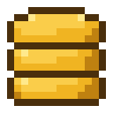

# Bank Item Value

**A RuneLite plugin that overlays the bank interface with per-item values and
colour-coded highlighting, modelled on the built-in Ground Items plugin.**

<!-- TODO: replace with a real screenshot: docs/screenshot.png -->

---

## ✨ Features

- 💰 Draws each bank item's total value (unit price × quantity) on the item
- 🎨 Five colour tiers (default, low, medium, high, insane) with configurable
  thresholds and colours, mirroring Ground Items
- 📈 Price source: Grand Exchange, high alchemy, or the highest of the two
- 🔢 Three number formats: short (`73K`), decimal (`73.5K`), exact (`73,542`)
- 🔲 Optional box outline or box fill highlighting per tier colour
- 🎒 Optionally overlays the inventory side panel while the bank is open
- 🫥 Bank placeholders render nothing
- ⚡ Values are cached per item and stack size, so a full bank renders cheaply

## 🛠️ Development

Run `./gradlew build` to build. Run the `BankItemValuePluginTest` main class
(or `./gradlew run`) to launch RuneLite with the plugin loaded.

## ⚙️ Configuration

### General

| Option | Default | Description |
|---|---|---|
| Show value text | on | Draw the item's total value as text on the item |
| Price source | Grand Exchange | `Grand Exchange` uses the GE price, `High Alchemy` uses the high alch value, `Highest of both` uses the larger of the two |
| Value format | Decimal | `Short` renders 73,542 as `73K`, `Decimal` as `73.5K`, `Exact` as `73,542`. Values under 1,000 always render as plain digits |
| Hide under value | 0 | Items whose total value is below this render no overlay at all |
| Apply to inventory | off | Also overlay the inventory side panel while the bank is open |

### Display

| Option | Default | Description |
|---|---|---|
| Text position | Bottom left | Corner of the item cell where the value text is drawn. The game draws stack counts at the top left, so the default avoids them |
| Text shadow | on | One-pixel offset shadow so text stays readable on light sprites |
| Use small font | on | Use the small Runescape font so text fits the ~36×32px bank cell |

### Highlighting

| Option | Default | Description |
|---|---|---|
| Highlight mode | Text only | `Text only` draws coloured value text. `Box outline` draws a 1px tier-coloured rectangle. `Box fill` fills the cell with the tier colour. `Outline and text` draws both. `None` disables the overlay |
| Fill opacity | 40 | Opacity (0–255) of the fill in `Box fill` mode |

### Value tiers

An item takes the colour of the highest enabled tier whose threshold is less
than or equal to the item's total value. An item worth exactly a threshold
amount is in that tier. Disabled tiers are skipped, and the value falls
through to the next tier down.

| Tier | Default threshold | Default colour |
|---|---|---|
| Default (below all tiers) | — |  |
| Low | 20,000 |  |
| Medium | 100,000 |  |
| High | 1,000,000 |  |
| Insane | 10,000,000 |  |

Each tier has an enable toggle, a threshold, and a colour (with editable
alpha).

## 📄 License

BSD 2-Clause. See [LICENSE](LICENSE).
